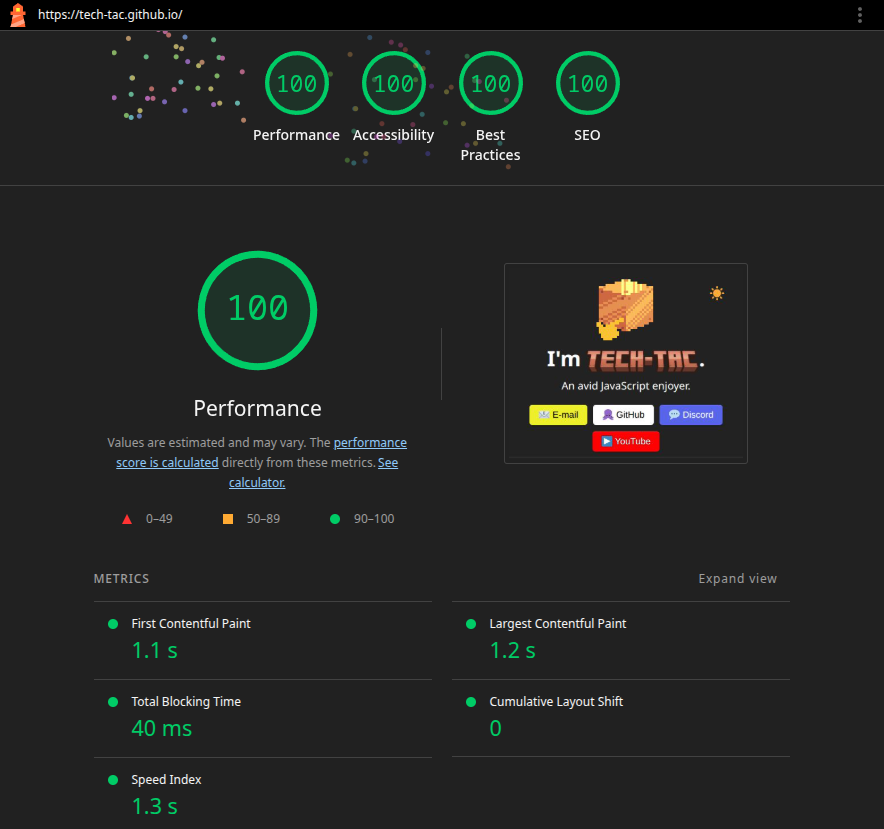

# Tech-Tac.github.io

A simple personal website showcasing my projects and ways to contact me,
made using raw HTML, CSS and no JavaScript.

It includes a light/dark mode switcher with graceful fallback for older browsers and follows the system theme by default, implemented with CSS only.

I got a perfect score on Google Lighthouse! 🎉
